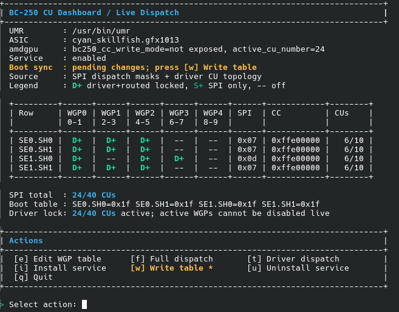
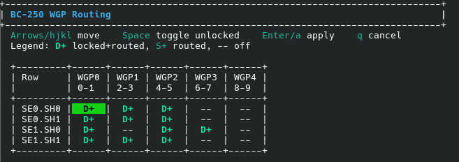

# BC-250 CU Live Manager

> **Interactive WGP and CU dispatch control for AMD BC-250 (`gfx1013`) using UMR.**
>
> Test factory, full, and custom WGP layouts from a terminal UI, then optionally save a chosen layout so it is restored on boot.

<p align="center">
  
  
  
  
</p>



---

## What this tool does

The AMD BC-250 normally boots with a **factory driver topology of 24 CUs**. This tool reads that driver topology, shows it in a live dashboard, and lets you route additional WGPs through UMR at runtime.

| Layout | Meaning | WGP count | CU count |
| --- | --- | ---: | ---: |
| **Factory WGPs** | WGPs enabled by the driver when AMDGPU boots | 12 WGPs | **24 CUs** |
| **Full dispatch** | All WGPs handled by this tool are routed | 20 WGPs | **40 CUs** |
| **Custom table** | Your manually selected WGP routing table | User selected | User selected |

Each **WGP contains 2 CUs**. The factory layout is therefore 12 WGPs, and full dispatch is 20 WGPs.

> [!IMPORTANT]
> Live changes are temporary unless you save the table and install the boot service. If you only apply a live table, the driver topology is restored after reboot.

---

## Quick start

Download the script:

```bash
curl -L -o bc250-cu-live-manager.sh https://raw.githubusercontent.com/WinnieLV/bc250-cu-live-manager/refs/heads/main/bc250-cu-live-manager.sh
chmod +x bc250-cu-live-manager.sh
```

Start the interactive UI:

```bash
sudo ./bc250-cu-live-manager.sh
```

Running the script without a command opens the menu.

If `umr` is missing, the UI warns you and asks once whether it should try to install it.

---

## Dashboard and editor

### Main dashboard


### WGP table editor



---

## Understanding the WGP table

The table is split into four shader-engine and shader-array rows:

| Row | Meaning |
| --- | --- |
| `SE0.SH0` | Shader Engine 0, Shader Array 0 |
| `SE0.SH1` | Shader Engine 0, Shader Array 1 |
| `SE1.SH0` | Shader Engine 1, Shader Array 0 |
| `SE1.SH1` | Shader Engine 1, Shader Array 1 |

Each row has five WGP positions:

| WGP | CU pair |
| ---: | --- |
| `WGP0` | `CU0-CU1` |
| `WGP1` | `CU2-CU3` |
| `WGP2` | `CU4-CU5` |
| `WGP3` | `CU6-CU7` |
| `WGP4` | `CU8-CU9` |

### Legend

| Marker | Meaning | Notes |
| --- | --- | --- |
| `D+` | Driver topology WGP, currently routed | Factory-enabled at driver boot. These form the 24 CU layout. |
| `S+` | SPI-routed WGP only | Enabled by the live routing table, not part of the driver boot topology. |
| `D!` | Driver topology WGP, not routed | Unsafe or blocked state. The script warns and refuses unsafe live disables. |
| `--` | Off | Not currently routed. |

`D+` entries are the factory WGPs reported by the driver when it booted. They are the reference point for the factory 24 CU configuration.

---

## Menu actions

The UI is designed so that write operations are reviewable. Pressing an action key does not silently write registers. Live write actions show a safety disclaimer and an apply confirmation unless `--yes` is used.

| Key | Menu label | Clear name | What happens |
| --- | --- | --- | --- |
| `e` | Edit WGP table | Custom WGP editor | Opens the WGP table editor. Toggle unlocked WGPs, then press `Enter` or `a` to review and apply the target table. |
| `f` | Full dispatch | Full 40 CU dispatch | Builds a target table where all 20 WGPs are routed. The table is written only after you accept the safety prompt and confirm the change. |
| `t` | Driver dispatch | Restore factory WGPs | Builds a target table from the driver boot topology. This returns routing to the factory 24 CU layout after confirmation. |
| `w` | Write table | Save current table | Saves the current live table to `/etc/bc250-cu-live-manager.conf`. This prepares it for boot restore, but does not install the service by itself. |
| `i` | Install service | Enable boot restore | Installs and enables the systemd service that reapplies the saved table on boot. It uses the table saved by `Write table`. |
| `u` | Uninstall service | Remove boot restore | Disables and removes the boot service and saved config. |
| `q` | Quit | Exit | Leaves the current live state as it is until reboot or until another action changes it. |

> [!NOTE]
> Full dispatch and Restore factory WGPs are live actions, but they are not applied just by pressing `f` or `t`. The script first shows the target table, then asks for confirmation. Only after confirmation are the registers updated.

---

## Editor controls

| Key | Action |
| --- | --- |
| Arrow keys | Move around the table |
| `h` `j` `k` `l` | Move using Vim-style keys |
| `Space` | Toggle the selected unlocked WGP |
| `Enter` or `a` | Review and apply the selected table |
| `q` | Cancel and return to the menu |

Driver-active WGPs cannot be disabled live. The editor keeps those entries locked to avoid unsafe live disable paths.

---

## Common workflows

### Try full 40 CU dispatch until reboot

```text
Open UI -> press f -> type accept -> review target table -> confirm y
```

This routes all 20 WGPs live. Nothing is saved for reboot unless you also use `Write table` and install the service.

### Make full 40 CU dispatch survive reboot

```text
Open UI -> press f -> type accept -> confirm y -> press w -> confirm y -> press i -> confirm y
```

This applies the 40 CU table, saves that live table, then installs the systemd service so the saved table is replayed on the next boot.

### Restore the factory 24 CU layout

```text
Open UI -> press t -> type accept -> review target table -> confirm y
```

This restores the WGP routing table to the driver boot topology, which is the factory 24 CU layout.

To keep the factory layout on future boots, either uninstall the boot service with `u`, or press `w` after restoring so the factory table becomes the saved boot table.

### Build and save a custom WGP layout

```text
Open UI -> press e -> toggle WGPs -> Enter -> type accept -> confirm y -> press w -> confirm y -> press i -> confirm y
```

This applies a custom table live, saves it, and enables automatic restore on boot.

---

## Temporary vs persistent changes

| Action | Changes live table now | Survives reboot by itself | Purpose |
| --- | ---: | ---: | --- |
| Apply from editor | Yes, after confirmation | No | Test a custom table live |
| Full dispatch | Yes, after confirmation | No | Test or apply 40 CUs live |
| Restore factory WGPs | Yes, after confirmation | No | Return to the 24 CU driver topology live |
| Write table | No | Not by itself | Save the current live table to config |
| Install service | No | Yes, if a table is saved | Reapply the saved table at boot |
| Apply service | Yes, after confirmation when run manually | No | Apply the saved boot table immediately |

For persistence, both steps matter:

```text
1. Write table
2. Install service
```

Installing the service without a saved table does not preserve the current live state. Writing a table without the service saves the config, but nothing reapplies it automatically after reboot.

---

## Write-table indicator

The action menu always shows:

```text
[w] Write table
```

When the saved boot table is missing or does not match the current live table, it becomes:

```text
[w] Write table *
```

The `*` means the current live table is not saved as the boot table.

---

## Requirements

### Hardware

- AMD BC-250
- PCI ID `13fe`

### Software

- `bash`
- `umr`
- `python3`
- `libdrm_amdgpu.so.1`
- `systemd` for boot restore
- Root privileges for register access

---

## Installing UMR

The built-in installer supports these package managers:

| System | Package tool |
| --- | --- |
| Arch / CachyOS | `pacman` / `paru` |
| Fedora | `dnf` |
| Bazzite and immutable Fedora systems | `rpm-ostree` |

### Arch, CachyOS, Fedora

```bash
sudo ./bc250-cu-live-manager.sh install-umr
sudo ./bc250-cu-live-manager.sh
```

### Bazzite / rpm-ostree

```bash
sudo ./bc250-cu-live-manager.sh install-umr
sudo reboot
sudo ./bc250-cu-live-manager.sh
```

Notes for immutable systems:

- `rpm-ostree install` changes the host image and requires a reboot.
- If `/usr/local/bin` is not writable, service installation falls back to `/var/usrlocal/bin`.

---

## Boot restore

Boot restore is optional. Use it only when you want a selected WGP table to return after reboot.

The saved config lives here:

```text
/etc/bc250-cu-live-manager.conf
```

Example:

```ini
BC250_WGP_MASKS=0x1f,0x1f,0x1f,0x1f
UMR_ASIC=cyan_skillfish.gfx1013
UMR_INSTANCE=1
UMR=/usr/bin/umr
```

| Key | Meaning |
| --- | --- |
| `BC250_WGP_MASKS` | Saved WGP masks in `SE0.SH0,SE0.SH1,SE1.SH0,SE1.SH1` order |
| `UMR_ASIC` | UMR ASIC selector |
| `UMR_INSTANCE` | UMR DRI instance |
| `UMR` | Path to the UMR binary |

The systemd unit loads this file as an `EnvironmentFile`. On boot, the service runs the saved table through `apply-service` using `--yes`, so it can restore the table without an interactive prompt.

---

## CLI reference

The UI is recommended, but the same operations can be scripted.

### Status

```bash
sudo ./bc250-cu-live-manager.sh status
```

### Live dispatch presets

```bash
# Enable all supported WGPs: 40 CUs after confirmation
sudo ./bc250-cu-live-manager.sh enable all

# Restore the driver boot topology: factory 24 CUs after confirmation
sudo ./bc250-cu-live-manager.sh stock-dispatch
```

### Target a single WGP or CU pair

```bash
sudo ./bc250-cu-live-manager.sh enable-wgp 1.0.4
sudo ./bc250-cu-live-manager.sh disable-wgp 1.0.4

sudo ./bc250-cu-live-manager.sh enable-cu 1.0.8
sudo ./bc250-cu-live-manager.sh disable-cu 1.0.8
```

`enable-cu` and `disable-cu` still operate at WGP granularity. For example, CU `8` maps to WGP `4`, which controls CU `8` and CU `9` together.

### Boot restore commands

```bash
# Save the current live table
sudo ./bc250-cu-live-manager.sh write-service-table

# Install and enable boot restore
sudo ./bc250-cu-live-manager.sh install-service

# Apply the saved table now
sudo ./bc250-cu-live-manager.sh apply-service

# Remove boot restore
sudo ./bc250-cu-live-manager.sh uninstall-service
```

### Useful flags

| Flag | Use case |
| --- | --- |
| `--yes` | Skip interactive prompts for trusted automation |
| `--dry-run` | Print intended UMR writes without applying them |
| `--force` | Override the BC-250 PCI detection guard |
| `--umr-instance <n>` | Force a specific UMR DRI instance |

Examples:

```bash
sudo ./bc250-cu-live-manager.sh --yes enable all
sudo ./bc250-cu-live-manager.sh --dry-run enable all
sudo ./bc250-cu-live-manager.sh --umr-instance 1 status
```

---

## What the script changes

The tool reads and writes these BC-250 dispatch-related registers through UMR:

- `mmCC_GC_SHADER_ARRAY_CONFIG`
- `mmSPI_PG_ENABLE_STATIC_WGP_MASK`
- `mmRLC_PG_ALWAYS_ON_WGP_MASK`

Defaults:

| Setting | Value |
| --- | --- |
| ASIC selector | `cyan_skillfish.gfx1013` |
| Register naming | `mm*` |

Apply operations clear the BC-250 CC harvest mask before writing SPI masks, following the known working live unlock sequence.

---

## Kernel patch

No kernel patch is required for this workflow.

This script writes live dispatch registers directly through UMR. Kernel patch material is still useful for research and alternate workflows, but it is not required for this tool.

---

## Safety behavior

- Write actions show a safety disclaimer unless `--yes` is used.
- Interactive dispatch actions show the current table, the target table, and the proposed WGP changes before applying.
- Type `accept` for the safety disclaimer, then confirm the dispatch plan with `y`.
- Live disable paths are blocked when they would disable driver-active WGPs.
- Driver-active WGPs are treated as locked in the editor.
- Boot persistence only happens after a table is saved and the service is installed.

---

## Credits and references

- Kernel patch and research base:  
  https://github.com/duggasco/bc250-40cu-unlock
- Live unlock test and demo script:  
  https://github.com/gennro/bc250-toolkit/blob/main/CachyOS-BC250-CU-Unlock.sh
